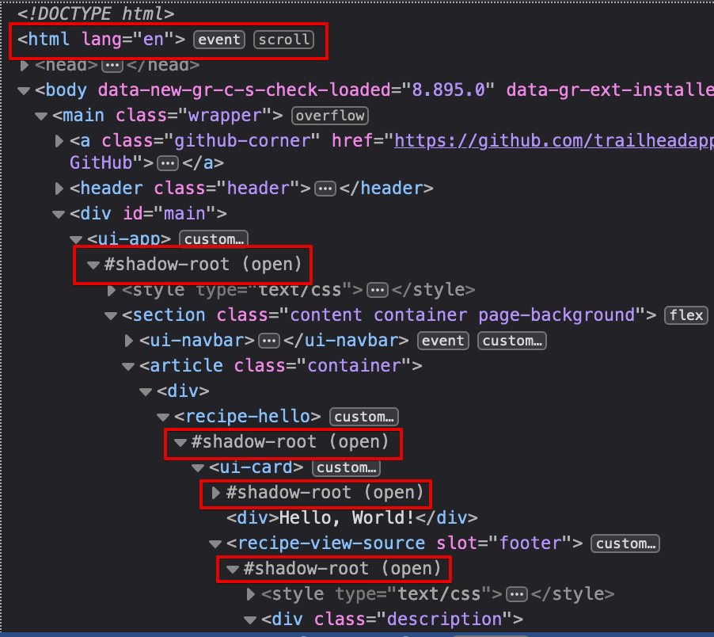

# Salesforce Lightning Playwright examples

- [Salesforce Lightning](https://www.salesforce.com/campaign/lightning/) uses a lot of shadow DOMs.
- [Playwright](https://playwright.dev/) can access the shadow DOMs.
- Here's examples of interacting with various elements.
- Visible browser is enabled for demo purposes.
- [SelectorsHub](https://selectorshub.com/) works well for finding the initial locators.

## Demo app

https://lwc-recipes-oss.herokuapp.com
